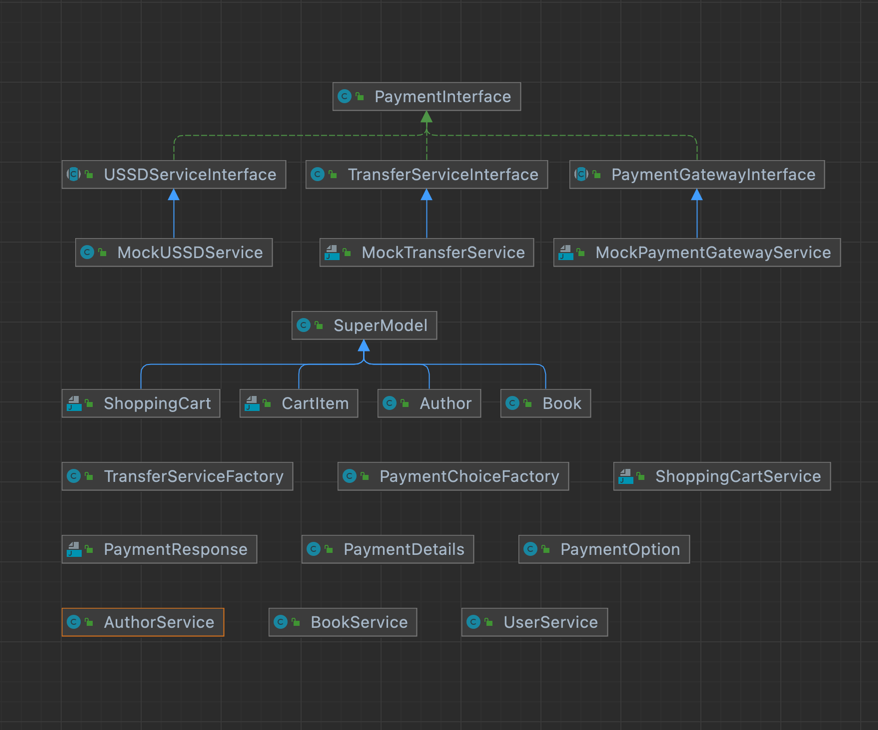

# Project Notes

---
### Simplify Structure
- The diagram shows the relationship that exist within the model and the service packages
- All the model classes extends a super class called  **SuperModel** to encapsulate properties common to all the models which is marked with the @MappedSuperclass
- The service layer especially uses the Factory design pattern to ensure extensibility is seamless and more payment method can be added easily.
- All payment methods inherit the **PaymentInterface** which abstract all functionalities common to all payment methods
- Each payment method then has its own super abstract class to further encapsulate what is specific to each of this method.
- A concrete class that implements each of this method has been provided which occur at the bottom of the hierarchy

---

---
### RUNING APPLICATION
- The application can be package as jar artifact by running the maven command: **mvn clean package** from the application root folder
- The commented line **//@SpringBootTest(classes = TestConfig.class)** on AuthController and UnAuthController are required to run the test cases from the IDE
- once the jar file is generated, we can run the application as a normal java application using the command: **java -jar bookstore-0.0.1.jar**
- Note: **bookstore-0.0.1.jar** is the name of the jar file generated and the run command above assumes we are running from the **/target directory** of the root folder of the application
- We can however run from any other directory by putting the jar file in that directory and specifying the path to it in the run command thus  **java -jar <path-to-jar>/bookstore-0.0.1.jar**
- A sample jar file name "bookstore-0.0.1.jar" has however been submitted with this solution.
- **To skip the test cases while building, we can include the flag -DskipTests in the maven command**
- [Download sample jar file here](https://www.dropbox.com/scl/fi/fe3xfptvfnimsonyphgxu/bookstore-0.0.1.jar?rlkey=fwvyeu5lt8ijvbiwse8kk28am&dl=0)
- Sample data too will be automatically generated at application start up
---